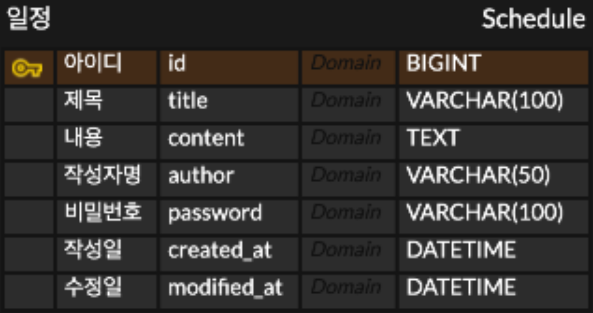

# 😎 일정 관리 앱

🍬 Spring Boot를 사용해서 만든 일정 관리 API입니다.
- 비밀번호가 일치할 때만 수정/삭제가 가능하고, 응답에서 비밀번호는 항상 제외!

---

## API 명세서

### 1. 일정 생성
새로운 일정을 등록합니다.

- **Method** : `POST`
- **URL** : `/api/schedules`
- **Request Body** :
```json
{
  "title": "제목",
  "content": "내용",
  "author": "작성자명",
  "password": "비밀번호"
}
```
- **Response** `201 Created` :
```json
{
  "id": 1,
  "title": "제목",
  "content": "내용",
  "author": "작성자명",
  "createdAt": "2026-04-10T10:00:00",
  "modifiedAt": "2026-04-10T10:00:00"
}
```

---

### 2. 전체 일정 조회
모든 일정을 조회합니다. 작성자 이름을 넣으면 그 사람 일정만 나오고, 
안 넣으면 전체 다 나옵니다. 최근에 수정된 것부터 보여줍니다.

- **Method** : `GET`
- **URL** : `/api/schedules?author=작성자명`
- **Request Param** (선택) : `author`
- **Response** `200 OK` :
```json
[
  {
    "id": 1,
    "title": "제목",
    "content": "내용",
    "author": "작성자명",
    "createdAt": "2026-04-10T10:00:00",
    "modifiedAt": "2026-04-10T10:00:00"
  }
]
```

---

### 3. 선택 일정 조회
ID를 기준으로 특정 일정 1건을 조회합니다.

- **Method** : `GET`
- **URL** : `/api/schedules/{id}`
- **Response** `200 OK` :
```json
{
  "id": 1,
  "title": "제목",
  "content": "내용",
  "author": "작성자명",
  "createdAt": "2026-04-10T10:00:00",
  "modifiedAt": "2026-04-10T10:00:00"
}
```

---

### 4. 일정 수정
제목이랑 작성자 이름만 바꿀 수 있고, 비밀번호가 틀리면 수정이 안 됩니다.

- **Method** : `PATCH`
- **URL** : `/api/schedules/{id}`
- **Request Body** :
```json
{
  "title": "수정된 제목",
  "author": "수정된 작성자명",
  "password": "비밀번호"
}
```
- **Response** `200 OK` :
```json
{
  "id": 1,
  "title": "수정된 제목",
  "content": "내용",
  "author": "수정된 작성자명",
  "createdAt": "2026-04-10T10:00:00",
  "modifiedAt": "2026-04-10T12:00:00"
}
```

---

### 5. 일정 삭제
비밀번호가 맞아야 삭제됩니다.

- **Method** : `DELETE`
- **URL** : `/api/schedules/{id}`
- **Request Body** :
```json
{
  "password": "비밀번호"
}
```
- **Response** `200 OK`:
```json
{
  "message": "삭제되었습니다."
}
```

---

## 🐹 ERD

